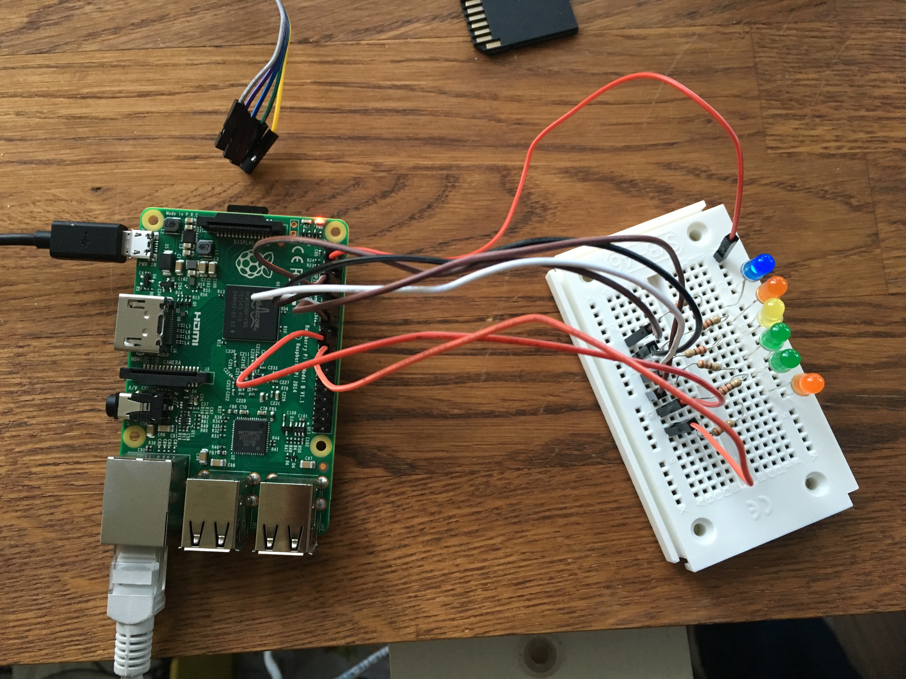

[](https://travis-ci.org/TheODI-UD2D/walvic)
[](https://gemnasium.com/TheODI-UD2D/walvic)
[](https://codeclimate.com/github/TheODI-UD2D/walvic)
[](https://github.com/badges/badgerbadgerbadger)

# Walvic

A Ruby script for the Raspberry Pi to show how crowded a station on the Victoria line is (with fake data currently)

# Installation

## Clone the repo:

```
git clone https://github.com/TheODI-UD2D/walvic.git
```

## Install Ruby Dependencies:

```
bundle install
```

## Set environment variables

Create a new file called .env and enter the variables in the following format:

SIR_HANDEL_USERNAME: {the username for the running instance of https://github.com/TheODI-UD2D/sir_handel}
SIR_HANDEL_PASSWORD: {the password for the running instance of https://github.com/TheODI-UD2D/sir_handel}

# Hardware

Your Raspberry Pi must be connected to a breadboard with LEDs at positions 15, 18, 23, 24, 25 and 8 (see diagram below), as well as earthing.


The final setup should look something like this:



# Running

Run `sudo bundle exec irb`

When the ruby console starts, you can then run

```
$:.unshift File.dirname('./lib')
require 'lib/walvic'
walvic = Walvic.new('euston', 'southbound')
walvic.illuminate
```

This process needs some cleaning up - probably a Rake task?

# Improvements

* Tests could be tighter
* Coveralls
* Rake task or CLI
* Trigger with a physical button maybe?
